# Search System Architecture & Instructions Diagram

## Visual Flow Diagram (Mermaid)

```mermaid
flowchart TD
    A[User Search Request<br/>POST /search] --> B{Query Processing<br/>Optional}
    B -->|Yes| C[CerebrasLLM.process_query_async<br/>📝 Instruction Set 1: Query Rewriting]
    B -->|No| D[Use Original Query]
    C --> D
    
    D --> E[Query Intent Detection<br/>Pattern-Based<br/>No LLM]
    E --> F[Generate Intent Instructions<br/>📝 Instruction Set 2]
    
    F --> G[TF-IDF Search<br/>Keyword Matching + Field Boosting]
    G --> H{Post Type Priority?}
    H -->|Yes| I[Apply Post Type Priority<br/>Sort by priority then score]
    H -->|No| J[Keep TF-IDF Order]
    I --> J
    
    J --> K{AI Reranking Enabled?}
    K -->|Yes| L[AI Reranking<br/>📝 Instruction Set 3 & 4<br/>Score: Semantic + Intent + Quality]
    K -->|No| M[Use TF-IDF Scores]
    L --> N[Calculate Hybrid Score<br/>tfidf × 0.3 + ai × 0.7]
    N --> O[Sort by Hybrid Score]
    M --> O
    
    O --> P[Apply Pagination<br/>offset:offset+limit]
    
    P --> Q{include_answer?}
    Q -->|Yes| R[Generate Answer<br/>📝 Instruction Set 5: Strict Mode]
    Q -->|No| S[Skip Answer]
    R --> S
    
    S --> T[Generate Alternative Queries<br/>📝 Instruction Set 6: Content-Based]
    
    T --> U{Results Found?}
    U -->|No| V[Zero Results Handler<br/>📝 Instruction Set 7: Alternatives]
    U -->|Yes| W[Final Response]
    V --> W
    
    W --> X[Return JSON Response<br/>results + answer + metadata]
    
    style C fill:#e1f5ff
    style F fill:#e1f5ff
    style L fill:#ffe1f5
    style R fill:#fff5e1
    style T fill:#e1ffe1
    style V fill:#ffe1e1
```



## Complete Search Flow

```
┌─────────────────────────────────────────────────────────────────────────────┐
│                           USER SEARCH REQUEST                               │
│                    POST /search?query="James Walsh"                         │
└───────────────────────────────┬─────────────────────────────────────────────┘
                                │
                                ▼
┌─────────────────────────────────────────────────────────────────────────────┐
│  STEP 1: QUERY PROCESSING (Optional)                                       │
│  ────────────────────────────────────────────────────────────────────────  │
│  File: main.py:307-312                                                      │
│  Component: CerebrasLLM.process_query_async()                               │
│                                                                              │
│  📝 INSTRUCTION SET 1: Query Rewriting                                      │
│  ────────────────────────────────────────────────────────────────────────  │
│  System: "You are a helpful search query optimization assistant."          │
│                                                                              │
│  User Prompt:                                                               │
│  "You are a search query optimization expert. Your task is to rewrite      │
│   and expand the user's search query to improve search results.             │
│                                                                              │
│   Original query: "{original_query}"                                        │
│   Context: {context}                                                        │
│                                                                              │
│   Please provide:                                                          │
│   1. A rewritten query that maintains the original intent but uses more   │
│      specific and searchable terms                                          │
│   2. 2-3 alternative query variations that might capture different aspects  │
│   3. Key terms and synonyms that should be considered                       │
│                                                                              │
│   Format your response as JSON:                                            │
│   {                                                                          │
│     "rewritten_query": "the main rewritten query",                         │
│     "alternative_queries": ["alt1", "alt2"],                               │
│     "key_terms": ["term1", "term2"],                                        │
│     "synonyms": ["syn1", "syn2"]                                            │
│   }"                                                                         │
│                                                                              │
│  Output: Rewritten query (or original if failed)                           │
└───────────────────────────────┬─────────────────────────────────────────────┘
                                │
                                ▼
┌─────────────────────────────────────────────────────────────────────────────┐
│  STEP 2: QUERY INTENT DETECTION                                            │
│  ────────────────────────────────────────────────────────────────────────  │
│  File: simple_hybrid_search.py:1027-1104                                    │
│  Component: SimpleHybridSearch.detect_query_intent()                         │
│                                                                              │
│  Pattern-Based Detection (No LLM):                                         │
│  - person_name: "James Walsh" (2 words, both capitalized)                  │
│  - executive_role: "Who is the CEO?" (role keywords)                       │
│  - service: Contains "service", "solutions", "consulting"                  │
│  - howto: Starts with "how", "what", "why", "when", "where"                 │
│  - navigational: Contains "contact", "about", "team"                         │
│  - transactional: Contains "buy", "download", "request"                    │
│  - general: Default fallback                                                │
│                                                                              │
│  Output: Intent type + Intent-based instructions                            │
└───────────────────────────────┬─────────────────────────────────────────────┘
                                │
                                ▼
┌─────────────────────────────────────────────────────────────────────────────┐
│  STEP 3: INTENT-BASED INSTRUCTIONS GENERATION                               │
│  ────────────────────────────────────────────────────────────────────────  │
│  File: simple_hybrid_search.py:1106-1199                                    │
│  Component: SimpleHybridSearch._generate_intent_based_instructions()         │
│                                                                              │
│  📝 INSTRUCTION SET 2: Intent-Based Instructions                            │
│  ────────────────────────────────────────────────────────────────────────  │
│                                                                              │
│  Example for person_name intent:                                           │
│  "User is searching for a specific person: "{query}".                        │
│                                                                              │
│  PRIORITY:                                                                  │
│  1. SCS Professionals profiles where the person's full name appears in       │
│     the title                                                               │
│  2. Biographical content about this specific person                         │
│  3. Press releases, announcements, or news about this person                 │
│                                                                              │
│  RULES:                                                                      │
│  - Only show results about THIS specific person                             │
│  - Boost exact name matches in titles                                       │
│  - Do NOT include general articles unless they're specifically about this   │
│    person                                                                    │
│  - If no professional profile exists, show news/articles about them"        │
│                                                                              │
│  Example for executive_role intent:                                         │
│  "User is asking about a specific executive role or position: "{query}".    │
│                                                                              │
│  PRIORITY:                                                                  │
│  1. SCS Professionals profiles where the person holds the specific role     │
│     mentioned (CEO, President, etc.)                                        │
│  2. Press releases or announcements naming the person in that role           │
│  3. Professional profiles that mention the role in title or content         │
│                                                                              │
│  RULES:                                                                      │
│  - Prioritize profiles where the person is CURRENTLY in that role           │
│  - Look for role keywords: CEO, President, Executive, Chief, Director        │
│  - Boost results where role appears in title (e.g., "Doug Doerr, CEO")     │
│  - For "Who is the CEO?", the person currently holding that title should   │
│    rank #1                                                                   │
│  - Recent announcements about role changes are highly relevant"            │
│                                                                              │
│  Output: Intent-specific instructions (combined with user's custom         │
│          instructions if provided)                                           │
└───────────────────────────────┬─────────────────────────────────────────────┘
                                │
                                ▼
┌─────────────────────────────────────────────────────────────────────────────┐
│  STEP 4: TF-IDF SEARCH                                                     │
│  ────────────────────────────────────────────────────────────────────────  │
│  File: simple_hybrid_search.py:1201-1272                                   │
│  Component: SimpleHybridSearch._tfidf_search()                             │
│                                                                              │
│  Process:                                                                   │
│  1. Transform query using fitted TF-IDF vectorizer                         │
│  2. Calculate cosine similarity with all documents                          │
│  3. Sort by similarity score                                                │
│  4. Apply field boosting:                                                   │
│     - Title matches: 1.5x boost                                             │
│     - Excerpt matches: 1.2x boost                                            │
│  5. Return top N candidates                                                 │
│                                                                              │
│  Output: Initial candidate results with TF-IDF scores                      │
└───────────────────────────────┬─────────────────────────────────────────────┘
                                │
                                ▼
┌─────────────────────────────────────────────────────────────────────────────┐
│  STEP 5: POST TYPE PRIORITY (Optional)                                     │
│  ────────────────────────────────────────────────────────────────────────  │
│  File: simple_hybrid_search.py:996-1025                                    │
│  Component: SimpleHybridSearch._apply_post_type_priority()                   │
│                                                                              │
│  Process:                                                                   │
│  - If post_type_priority provided (e.g., ['scs-professionals', 'page'])    │
│  - Sort results: priority first, then by score                             │
│  - Lower index = higher priority                                            │
│                                                                              │
│  Output: Results sorted by post type priority + score                       │
└───────────────────────────────┬─────────────────────────────────────────────┘
                                │
                                ▼
┌─────────────────────────────────────────────────────────────────────────────┐
│  STEP 6: AI RERANKING (If Enabled)                                          │
│  ────────────────────────────────────────────────────────────────────────  │
│  File: cerebras_llm.py:508-785                                             │
│  Component: CerebrasLLM.rerank_results_async()                              │
│                                                                              │
│  📝 INSTRUCTION SET 3: AI Reranking System Prompt                            │
│  ────────────────────────────────────────────────────────────────────────  │
│                                                                              │
│  System Prompt:                                                             │
│  "You are an expert search relevance analyzer for SCS Engineers, a         │
│   professional environmental consulting firm.                               │
│                                                                              │
│   BUSINESS CONTEXT:                                                         │
│   - SCS Engineers provides environmental, engineering, and consulting      │
│     services                                                                │
│   - Main services include: waste management, environmental compliance,     │
│     sustainability consulting                                               │
│   - Post types you'll see:                                                  │
│     * "scs-professionals": Staff member profiles with expertise             │
│     * "scs-services": Service descriptions and capabilities                │
│     * "page": General pages (About, Services, Projects, Contact)            │
│     * "post": Blog articles, case studies, news                             │
│                                                                              │
│   YOUR JOB:                                                                 │
│   Score search results based on how well they match user queries for this   │
│   business context. Consider business priorities: professional expertise,   │
│   service offerings, and user intent."                                      │
│                                                                              │
│  📝 INSTRUCTION SET 4: AI Reranking User Prompt                              │
│  ────────────────────────────────────────────────────────────────────────  │
│                                                                              │
│  User Prompt:                                                               │
│  "Analyze these search results for the query: "{query}"                     │
│                                                                              │
│   {results_text}                                                            │
│                                                                              │
│   📊 SCORING CRITERIA (Rate each result 0-100):                             │
│                                                                              │
│   1. **Semantic Relevance** (40 points)                                     │
│      - Does the content match the query's semantic meaning?                 │
│      - Is it exactly what the user is looking for?                          │
│                                                                              │
│   2. **User Intent** (30 points)                                            │
│      - Does it address what the user wants to accomplish?                   │
│                                                                              │
│      INTENT SCORING:                                                        │
│      • PERSON NAME ("James Walsh"):                                         │
│        - scs-professionals profile → Score: 95                             │
│        - Article mentioning person → Score: 75                              │
│        - Generic → Score: 30                                                │
│                                                                              │
│      • EXECUTIVE ROLE ("Who is the CEO?"):                                  │
│        - scs-professionals profile with role in title → Score: 100        │
│        - Profile mentioning role → Score: 95                               │
│        - Press release naming CEO → Score: 90                              │
│        - Article mentioning CEO → Score: 70                                │
│        - Generic → Score: 30                                                │
│                                                                              │
│      • SERVICE ("hazardous waste"):                                         │
│        - scs-services page → Score: 95                                     │
│        - Case study → Score: 80                                            │
│        - Blog post → Score: 50                                              │
│                                                                              │
│      • HOW-TO ("how to"):                                                   │
│        - Step-by-step guide → Score: 90                                     │
│        - Case study → Score: 70                                            │
│        - General page → Score: 40                                           │
│                                                                              │
│      • NAVIGATIONAL ("contact"):                                           │
│        - Exact page → Score: 100                                            │
│        - Related page → Score: 65                                          │
│        - Article → Score: 25                                                │
│                                                                              │
│      • TRANSACTIONAL ("request quote"):                                    │
│        - Action page → Score: 95                                           │
│        - Mentions service → Score: 60                                      │
│        - Article → Score: 35                                                │
│                                                                              │
│      SPECIAL CASE - CEO/PRESIDENT QUERIES:                                  │
│      When query asks "Who is the CEO?" or similar:                          │
│      - Professional profile of CURRENT CEO with role in title → Score: 100  │
│      - Professional profile mentioning CEO role → Score: 95                 │
│      - Press release announcing CEO → Score: 90                            │
│      - Article mentioning CEO → Score: 70                                   │
│      - Other professionals → Score: 30-40                                  │
│      - Blog posts about leadership → Score: 40-50                          │
│                                                                              │
│   3. **Content Quality** (20 points)                                        │
│      - Based on title and excerpt, does it seem comprehensive?              │
│      - Is it from a credible source (inferred from title/URL)?             │
│      - Does it appear to be high-quality content?                          │
│                                                                              │
│   4. **Specificity** (10 points)                                            │
│      - Is it specifically about the topic or too broad/general?             │
│      - Does it cover the exact aspect the user asked about?                 │
│                                                                              │
│   {Custom Instructions if provided}                                          │
│                                                                              │
│   🎯 RETURN FORMAT:                                                          │
│   Return a JSON array with scores for EACH result (include all N results):  │
│   [                                                                          │
│     {"id": "1", "ai_score": 95, "reason": "Direct answer..."},            │
│     {"id": "2", "ai_score": 88, "reason": "Comprehensive guide..."},     │
│     ...                                                                      │
│   ]                                                                          │
│                                                                              │
│   ⚠️ IMPORTANT:                                                             │
│   - Include ALL N results in the SAME ORDER                                 │
│   - Be strict but fair in scoring                                          │
│   - Higher score = more relevant to the query                               │
│   - Consider the custom criteria if provided                                │
│   - Scores should range from 0-100"                                         │
│                                                                              │
│  Process:                                                                   │
│  1. LLM scores each result (0-100)                                         │
│  2. Normalize AI scores to 0-1                                              │
│  3. Calculate hybrid score:                                                 │
│     hybrid_score = (tfidf_score × tfidf_weight) + (ai_score × ai_weight)   │
│     Default: ai_weight = 0.7, tfidf_weight = 0.3                           │
│  4. Sort by hybrid_score DESC                                               │
│  5. Apply post_type_priority within same score                             │
│                                                                              │
│  Output: Reranked results with ai_score, hybrid_score, ranking_explanation │
└───────────────────────────────┬─────────────────────────────────────────────┘
                                │
                                ▼
┌─────────────────────────────────────────────────────────────────────────────┐
│  STEP 7: PAGINATION                                                        │
│  ────────────────────────────────────────────────────────────────────────  │
│  File: simple_hybrid_search.py:571                                         │
│  Component: SimpleHybridSearch.search()                                       │
│                                                                              │
│  Process:                                                                   │
│  - Apply offset and limit to reranked results                               │
│  - Update ranking_explanation positions                                    │
│                                                                              │
│  Output: Paginated results (offset:offset+limit)                            │
└───────────────────────────────┬─────────────────────────────────────────────┘
                                │
                                ▼
┌─────────────────────────────────────────────────────────────────────────────┐
│  STEP 8A: GENERATE ANSWER (If include_answer=true)                         │
│  ────────────────────────────────────────────────────────────────────────  │
│  File: cerebras_llm.py:121-284                                              │
│  Component: CerebrasLLM.generate_answer()                                    │
│                                                                              │
│  📝 INSTRUCTION SET 5: Answer Generation (Strict Mode)                      │
│  ────────────────────────────────────────────────────────────────────────  │
│                                                                              │
│  System Message:                                                            │
│  "You are a research assistant that answers questions using ONLY the        │
│   provided search results. You MUST NOT use any external knowledge,         │
│   assumptions, or information not explicitly present in the search results.  │
│                                                                              │
│   CRITICAL STRICT MODE RULES:                                               │
│   1. Do NOT add ANY context that is not in the search results               │
│   2. Do NOT infer what the user might be looking for                        │
│   3. Do NOT add details like "musician, singer, songwriter" unless they     │
│      appear in the results                                                  │
│   4. If results don't mention something, do NOT mention it either - even to  │
│      say it's not there                                                      │
│   5. NEVER mention topics, terms, or concepts from external knowledge -     │
│      only use what's in the search results                                  │
│   6. Simply state what IS in the results, nothing more, nothing less"      │
│                                                                              │
│  User Prompt:                                                               │
│  "STRICT MODE: You MUST answer using ONLY the provided search results.      │
│                                                                              │
│   CRITICAL RULES - DO NOT VIOLATE:                                          │
│   1. ONLY use information that appears in the search results                │
│   2. Do NOT add ANY external knowledge, assumptions, or context               │
│   3. Do NOT infer what the user might be looking for                        │
│   4. Do NOT add details that don't appear in the results                     │
│   5. NEVER mention topics, terms, or concepts that don't appear in the      │
│      search results - even to say they're not there                         │
│   6. ONLY state what IS in the results - do NOT mention what is NOT in the  │
│      results                                                                 │
│                                                                              │
│   HOW TO ANSWER - STEP BY STEP:                                             │
│   1. Read all source titles and excerpts                                     │
│   2. Extract ONLY facts that are explicitly stated                          │
│   3. If you see conflicting information, mention both sources              │
│   4. Cite your sources clearly (Source 1, Source 2)                         │
│   5. If information isn't in the results, simply omit it - DO NOT mention   │
│      it                                                                      │
│                                                                              │
│   BAD EXAMPLES (DON'T DO THIS):                                              │
│   ❌ "James Walsh is a musician, singer, and songwriter"                    │
│      → WRONG! You added "musician" - that's not in search results!         │
│   ❌ "I cannot find information about James Walsh being a musician or       │
│      singer"                                                                 │
│      → WRONG! Don't mention "musician" or "singer" at all - they're not in  │
│        the results!                                                          │
│   ❌ "The search results do not include information about biography,        │
│      musician, singer, or Starsailor"                                       │
│      → WRONG! These terms are not in the results, so don't mention them!   │
│                                                                              │
│   GOOD EXAMPLES (DO THIS):                                                   │
│   ✅ "The search results show James Walsh is the CEO of SCS Engineers        │
│      (Source 1). He was elected to the Environmental Research and           │
│      Education Foundation board (Source 1)."                                 │
│   ✅ "Based on Source 1, the project involved soil remediation. Source 2    │
│      mentions the project lasted 18 months."                                │
│                                                                              │
│   REMEMBER: If it's not in the search results, it doesn't exist. Don't     │
│   mention it at all.                                                         │
│                                                                              │
│   CONTEXT: User is likely looking for professional information about SCS    │
│   Engineers. Common queries: staff members, services, projects, environmental  │
│   solutions.                                                                 │
│                                                                              │
│   {Custom Instructions if provided}                                           │
│                                                                              │
│   Question: "{query}"                                                        │
│                                                                              │
│   Search Results:                                                            │
│   {context}                                                                  │
│                                                                              │
│   Answer:"                                                                   │
│                                                                              │
│  Output: Generated answer based on search results                            │
└───────────────────────────────┬─────────────────────────────────────────────┘
                                │
                                ▼
┌─────────────────────────────────────────────────────────────────────────────┐
│  STEP 8B: GENERATE CONTENT-BASED ALTERNATIVE QUERIES                       │
│  ────────────────────────────────────────────────────────────────────────  │
│  File: simple_hybrid_search.py:732-824                                     │
│  Component: SimpleHybridSearch.generate_content_based_alternative_queries()  │
│                                                                              │
│  📝 INSTRUCTION SET 6: Content-Based Alternative Queries                    │
│  ────────────────────────────────────────────────────────────────────────  │
│                                                                              │
│  System: "You are a search query expansion expert that generates            │
│           alternative queries based ONLY on provided content."               │
│                                                                              │
│  User Prompt:                                                                │
│  "You are a search query expert. I searched for: "{query}" and got these   │
│   results:                                                                  │
│                                                                              │
│   {results_text}                                                             │
│                                                                              │
│   Generate 3-5 alternative search queries that users might use to find      │
│   SIMILAR content to what's shown here.                                     │
│                                                                              │
│   CRITICAL RULES:                                                            │
│   1. ONLY use terms, topics, and concepts that appear in the search results │
│      above                                                                   │
│   2. Do NOT suggest queries about content that doesn't exist in the results │
│   3. Use different phrasings, synonyms, or related terms that appear in     │
│      these results                                                           │
│   4. Make the queries diverse - cover different aspects shown in the results │
│   5. Ensure each alternative query would likely find similar or related      │
│      content                                                                 │
│                                                                              │
│   Return ONLY the queries, one per line, without numbering or bullet       │
│   points."                                                                   │
│                                                                              │
│  Output: List of alternative queries based on actual content                  │
└───────────────────────────────┬─────────────────────────────────────────────┘
                                │
                                ▼
┌─────────────────────────────────────────────────────────────────────────────┐
│  STEP 9: ZERO RESULTS HANDLING (If no results)                              │
│  ────────────────────────────────────────────────────────────────────────  │
│  File: zero_result_handler.py:30-99                                        │
│  Component: ZeroResultHandler.handle_zero_results()                          │
│                                                                              │
│  📝 INSTRUCTION SET 7: Zero Results Alternative Queries                    │
│  ────────────────────────────────────────────────────────────────────────  │
│                                                                              │
│  System: "You are a helpful search assistant."                              │
│                                                                              │
│  User Prompt:                                                                │
│  "The search query "{query}" returned no results.                          │
│   Suggest 5 alternative search queries that might help the user find what   │
│   they're looking for.                                                      │
│                                                                              │
│   Consider:                                                                 │
│   - Synonyms and related terms                                               │
│   - Broader or more specific versions                                        │
│   - Common variations                                                        │
│   - Domain-specific terminology (environmental, compliance, engineering,     │
│     audits)                                                                 │
│                                                                              │
│   Return ONLY the alternative queries, one per line, without explanations."  │
│                                                                              │
│  Output: Alternative query suggestions                                       │
└───────────────────────────────┬─────────────────────────────────────────────┘
                                │
                                ▼
┌─────────────────────────────────────────────────────────────────────────────┐
│                           FINAL RESPONSE                                    │
│  ────────────────────────────────────────────────────────────────────────  │
│  {                                                                           │
│    "results": [...],                                                         │
│    "answer": "...", (if include_answer=true)                                │
│    "query_analysis": {                                                       │
│      "original_query": "...",                                                │
│      "rewritten_query": "...",                                               │
│      "content_based_alternative_queries": [...]                               │
│    },                                                                        │
│    "metadata": {                                                             │
│      "ai_reranking_used": true,                                             │
│      "query_intent": "person_name",                                          │
│      "intent_instructions": "...",                                            │
│      "ranking_explanation": {...}                                             │
│    }                                                                         │
│  }                                                                           │
└─────────────────────────────────────────────────────────────────────────────┘
```

## Additional Instruction Sets

### Query Suggestions (Autocomplete)
**File:** `suggestions.py:83-136`  
**Component:** `SuggestionEngine._get_llm_suggestions()`

**📝 INSTRUCTION SET 8: Autocomplete Suggestions**
```
System: "You are a helpful search suggestion assistant."

User Prompt:
"Given the partial search query "{partial_query}", suggest {limit} complete 
search queries that a user might want to search for.

Focus on:
- Completing the partial query naturally
- Related searches users might want
- Common variations and expansions
- Domain-relevant queries (environmental, compliance, engineering, audits)

Return ONLY the suggested queries, one per line, without numbering or 
explanations."
```

### Query Expansion (LLM-based)
**File:** `query_expander.py:116-166`  
**Component:** `QueryExpander.expand_with_llm()`

**📝 INSTRUCTION SET 9: Query Expansion**
```
System: "You are a search query expansion expert."

User Prompt:
"Given the search query "{query}", suggest {max_expansions} related search 
queries using synonyms and alternative phrasings.

Focus on:
- Using synonyms for key terms
- Alternative ways to phrase the same question
- Related topics users might also search for
- Domain-specific terminology (environmental, compliance, engineering)

Return ONLY the queries, one per line."
```

### Query Rewriting
**File:** `cerebras_llm.py:33-80`  
**Component:** `CerebrasLLM.rewrite_query()`

**📝 INSTRUCTION SET 10: Query Rewriting**
```
System: "You are a helpful search query optimization assistant."

User Prompt:
"You are a search query optimization expert. Your task is to rewrite and 
expand the user's search query to improve search results.

Original query: "{original_query}"
Context: {context}

Please provide:
1. A rewritten query that maintains the original intent but uses more 
   specific and searchable terms
2. 2-3 alternative query variations that might capture different aspects 
   of the search intent
3. Key terms and synonyms that should be considered

Format your response as JSON:
{
  "rewritten_query": "the main rewritten query",
  "alternative_queries": ["alternative 1", "alternative 2"],
  "key_terms": ["term1", "term2"],
  "synonyms": ["synonym1", "synonym2"]
}

Keep the rewritten query concise but comprehensive. Focus on terms that 
would appear in relevant documents."
```

## Instruction Flow Summary

1. **Query Processing** → Rewrites/expands query (Optional)
2. **Intent Detection** → Pattern-based detection (No LLM)
3. **Intent Instructions** → Generates intent-specific instructions
4. **TF-IDF Search** → Initial candidate retrieval
5. **Post Type Priority** → Re-sorts by post type (Optional)
6. **AI Reranking** → Scores results using LLM (if enabled)
7. **Answer Generation** → Generates answer from results (if requested)
8. **Alternative Queries** → Generates content-based alternatives
9. **Zero Results** → Suggests alternatives if no results

## Key Features

- **Strict Mode**: Answer generation only uses search results, no external knowledge
- **Intent-Based**: Different instructions for person names, executive roles, services, etc.
- **Custom Instructions**: Users can provide custom AI instructions for reranking/answering
- **Hybrid Scoring**: Combines TF-IDF scores with AI scores (configurable weights)
- **Post Type Priority**: Can prioritize certain post types (e.g., professionals first)
- **Content-Based Alternatives**: Generates alternatives based on actual search results
- **Zero Result Handling**: Provides helpful suggestions when no results found

## Configuration Parameters

- `enable_ai_reranking`: Enable/disable AI reranking (default: true)
- `ai_weight`: Weight for AI score in hybrid calculation (default: 0.7)
- `ai_reranking_instructions`: Custom instructions for reranking
- `ai_instructions`: Custom instructions for answer generation
- `strict_ai_answer_mode`: Only use search results for answers (default: true)
- `post_type_priority`: List of post types in priority order

